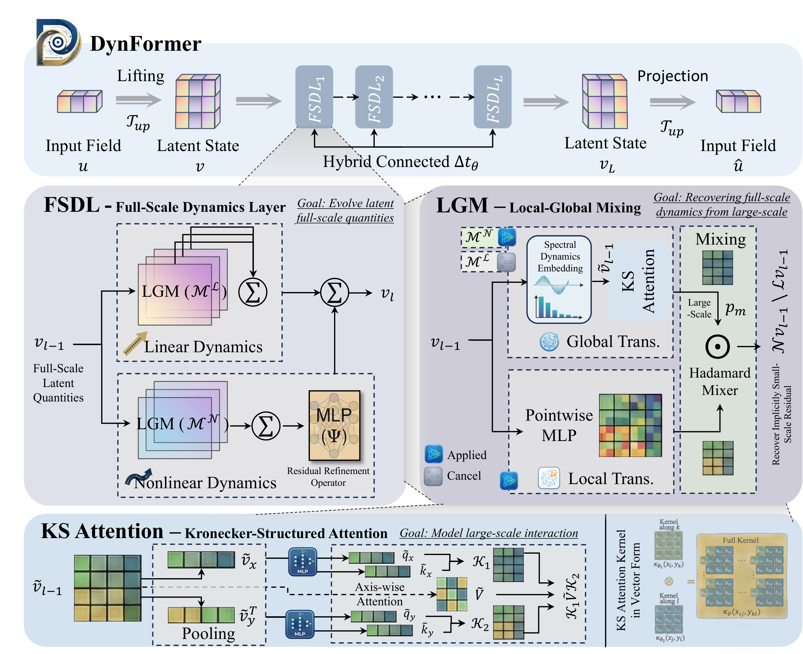
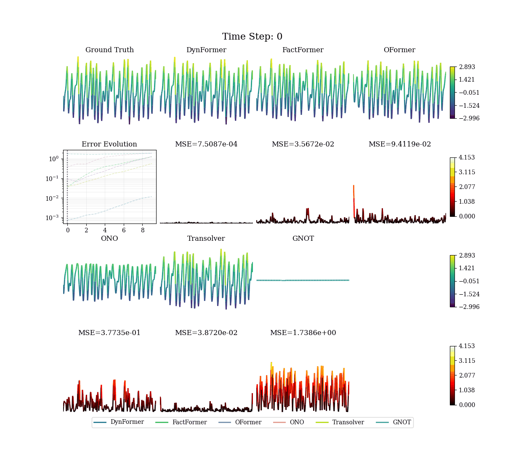
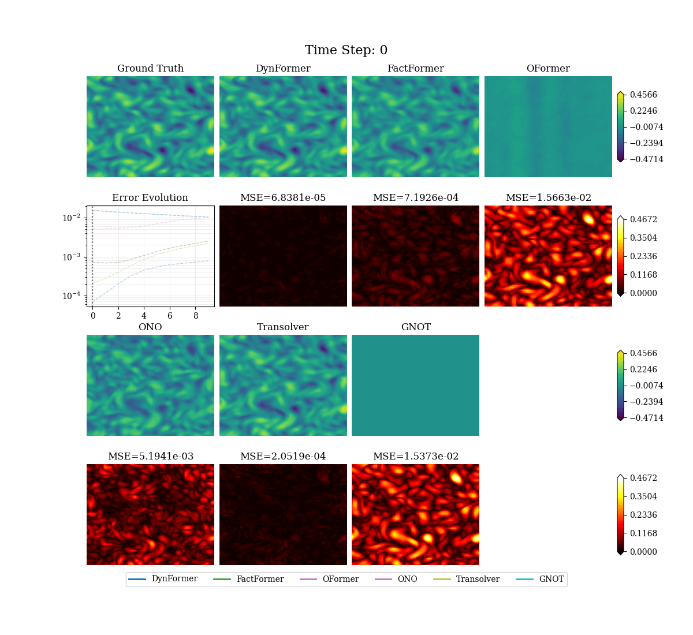
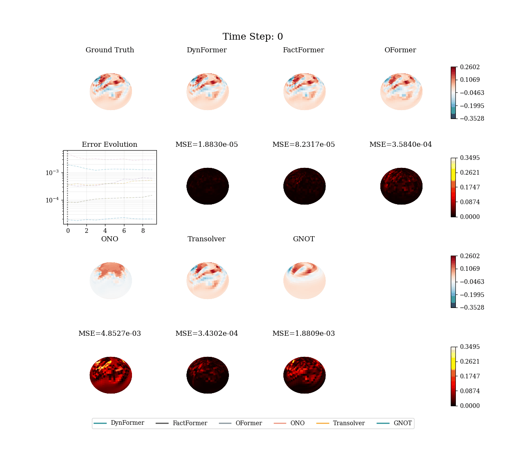
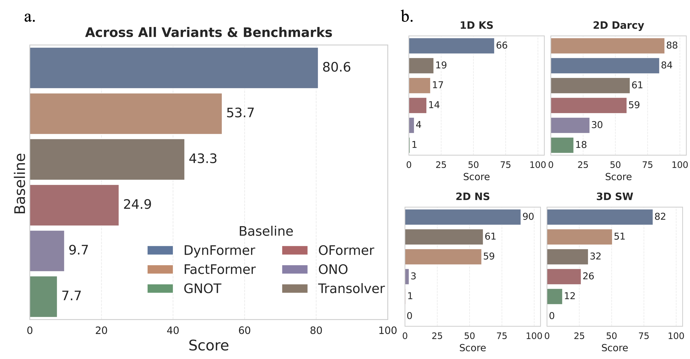

<div align="center">
  

  <h1>From Complex Dynamics to DynFormer: Rethinking Transformers for PDEs</h1>

  <p>
    <a href="https://opensource.org/licenses/MIT"></a>
    <a href="https://www.python.org/downloads/"></a>
    <a href="https://pytorch.org/"></a>
  </p>
</div>

> **DynFormer** rethinks Transformers for PDEs through the lens of complex dynamics, assigning specialized modules to distinct physical scales — **Spectral Embedding** isolates low-frequency modes, **Kronecker-Structured Attention** captures global interactions at O(N³), and **LGM** reconstructs small-scale turbulent cascades via nonlinear frequency mixing.

<p align="center">
  
</p>
<p align="center"><i>Overview of DynFormer's performance across four PDE benchmarks and baselines' peak GPU memory consumption.</i></p>

## ✨ Highlights

- **Rethinking Transformers via the Slaving Principle**: Exposes the inefficiency of treating physical fields as uniform tokens. By bridging neural architecture with the slaving principle of complex dynamics, DynFormer shifts from monolithic attention to a scale-specialized processing paradigm
- **Spectral Separation & Kronecker Attention**: A spectral embedding mechanism truncates high frequencies to isolate large-scale, low-frequency modes. On this latent manifold, Kronecker-structured attention leverages axis-wise factorization, reducing spatial complexity from O(N⁴) to **O(N³)** while preserving long-range physical coupling
- **Small-Scale Reconstruction via LGM**: Because small-scale dynamics are slaved to macroscopic states, DynFormer bypasses expensive full-grid attention for high frequencies. The LGM transformation uses multiplicative frequency mixing — analogous to nonlinear convective transport — to implicitly reconstruct sub-grid turbulent cascades
- **State-of-the-Art Performance**: Achieves up to **95.1% error reduction** on chaotic KS dynamics and **82.8% improvement** on 3D Shallow Water, while operating at nearly **double the memory efficiency** of competing methods

## 📁 Project Structure

```
DynFormer/
├── README.md                    # This file
├── environment-minimal.yml      # Conda environment specification
├── LICENSE                      # MIT License
├── assets/                      # Figures and animations for documentation
│
├── Basic/                       # Simplified standalone version of the framework
│   ├── main.py
│   ├── Trainer.py
│   ├── Evaluator.py
│   ├── Preprocessor.py
│   ├── Visualizer.py
│   ├── Loss.py
│   └── utils.py
│
└── DynFormer/                   # Main framework
    ├── main.py                  # Entry point for training, inference, and visualization
    ├── Trainer.py               # Training loop with checkpointing
    ├── Evaluator.py             # Inference and metrics evaluation
    ├── Preprocessor.py          # Data loading, normalization, and preprocessing
    ├── Visualizer.py            # Visualization and animation utilities
    ├── Loss.py                  # Loss functions (reconstruction + consistency)
    ├── utils.py                 # Utility functions and model factory
    │
    ├── Models/                  # Neural operator implementations
    │   ├── DynFormer.py         # DynFormer model (proposed)
    │   ├── DynFormer-Ablation.py # DynFormer ablation variants
    │   ├── FactFormer.py        # FactFormer baseline
    │   ├── GNOT.py              # General Neural Operator Transformer
    │   ├── OFormer.py           # OFormer baseline
    │   ├── ONO.py               # Orthogonal Neural Operator
    │   └── Transolver.py        # Transolver baseline
    │
    ├── Configs/                 # Configuration files organized by model
    │   ├── DynFormer/           # DynFormer configs
    │   │   └── Base/            #   Base configs (1dKS, 2dDarcy, 2dNS, 3dSW)
    │   ├── FactFormer/          # FactFormer configs
    │   ├── GNOT/                # GNOT configs
    │   ├── OFormer/             # OFormer configs
    │   ├── ONO/                 # ONO configs
    │   └── Transolver/          # Transolver configs
    │
    ├── DataGeneration/          # Dataset generation scripts
    │   ├── 1dKS_generation.m         # 1D Kuramoto-Sivashinsky (MATLAB)
    │   ├── 2dBurgers_generation.m    # 2D Burgers equation (MATLAB)
    │   ├── 2dNS_generation.m         # 2D Navier-Stokes (MATLAB)
    │   ├── 2dDarcy_genearation.py    # 2D Darcy flow (Python)
    │   ├── 3dsw_generation.py        # 3D Shallow Water (Python)
    │   └── 3dsw_dataprocess.py       # 3D Shallow Water data processing
    │
    ├── Datasets/                # Dataset directory (not tracked)
    └── Results/                 # Training results and checkpoints
```

## 🚀 Installation

### Setup

```bash
# Clone the repository
git clone https://github.com/Lain-PY/DynFormer.git
cd DynFormer

# Create conda environment
conda env create -f environment-minimal.yml
conda activate neuralop
```

### ONO Model Dependencies

If you plan to run the **ONO** (Orthogonal Neural Operator) model, install its additional dependencies:

```bash
pip install -r DynFormer/Models/requirements_ONO.txt
```

## 📖 Usage

### Quick Start

```bash
cd DynFormer

# Train + Inference (set "train": true, "inference": true in config)
python main.py --config Configs/DynFormer/Base/config_2dns_DynFormer.json

# Inference only (set "train": false, "inference": true)
python main.py --config Configs/DynFormer/Base/config_2dns_DynFormer.json

# Visualization (set "visualize": true)
python main.py --config Configs/DynFormer/Base/config_2dns_DynFormer.json
```

### Configuration

All hyperparameters are controlled via JSON configuration files. Key sections include:

| Section | Description |
|---------|-------------|
| `data` | Dataset paths, dimensions, normalization, history steps, and input/output settings |
| `model` | Model architecture, hidden dimensions, number of layers, spectral modes, attention heads |
| `training` | Epochs, batch size, learning rate, checkpointing, variant ID |
| `visualization` | Visualization settings for comparing models |
| `loss` | Loss function types (reconstruction, consistency) and weights |

**Example configuration:**

```json
{
  "device": "cuda:0",
  "verbose": 1,
  "data": {
    "dataset_path": "./Datasets/2dNS_1200x20x1x64x64_dt1_t[10_30]_nu1e-05.mat",
    "dataset_name": "2dNS",
    "data_space_dim": 2,
    "ntrain": 1000,
    "ntest": 200,
    "input_dim": 1,
    "inp_involve_history_step": 9,
    "output_dim": 1
  },
  "model": {
    "model_name": "DynFormer",
    "model_path": "./Models/DynFormer.py",
    "hidden_dim": 32,
    "num_layers": 4,
    "num_nonlinear": 1,
    "num_linear": 1,
    "spectral_modes": [12, 12],
    "n_head": 4,
    "global_kernel": "KSAttention",
    "local_kernel": "mlp",
    "out_steps": 1
  },
  "training": {
    "train": true,
    "inference": true,
    "num_epochs": 500,
    "batch_size": 64,
    "lr": 1e-3,
    "variant_id": "default"
  },
  "loss": {
    "reccons_type": "relative_mse",
    "consist_type": "relative_mse",
    "weight_reccons": 1.0,
    "weight_consist": 0.0
  }
}
```

### Command Line Arguments

| Argument | Description | Default |
|----------|-------------|---------|
| `--config` | Path to configuration file | `Configs/FNO/config_3dbrusselator_FNO.json` |
| `--physical_gpu_id` | Physical GPU ID for logging | `0` |

## 🧠 Model Architecture

DynFormer follows a simple but powerful philosophy: **the neural architecture should mirror how nature evolves**. Rather than forcing a single attention mechanism to process all scales, DynFormer explicitly abandons uniform tokenization and establishes a framework where network modules are strictly bound to physical scales.

<p align="center">
  
</p>
<p align="center"><i>Illustration of the DynFormer architecture.</i></p>

### Key Components

1. **Lifting / Projection**: Pointwise MLPs mapping between physical fields and latent space
2. **Spectral Dynamics Embedding**: 2D FFT → retain lowest M₁×M₂ modes → learnable complex spectral kernels → isolate large-scale latent state
3. **Kronecker-Structured Attention**: Axis-wise factorized attention with RoPE, computing **K₁ · V · K₂ᵀ** at O(N³) instead of O(N⁴)
4. **LGM Transformation**: Hadamard product of global (spectral + attention) × local (MLP) branches — multiplicative mixing reconstructs high-frequency residuals via the Convolution Theorem
5. **Full-Scale Dynamics Layer (FSDL)**: Combines nonlinear LGM + linear LGM + Ψ_θ refinement MLP, analogous to operator splitting
6. **Latent Evolution**: *L* stacked FSDLs with learnable Δt per layer, supporting three variants:

| Variant | Formula | Best For |
|---------|---------|----------|
| **Hierarchical** | v_l = v_{l-1} + Δt_l · F_l(v_{l-1}) | Autoregressive time-stepping |
| **Parallel** | v_L = v_0 + Δt · Σ_l F_l(v_0) | Steady-state (e.g., Darcy) |
| **Hybrid** | v_L = v_0 + Σ_l Δt_l · F_l(v_{l-1}) | Chaotic dynamics (adaptive Runge-Kutta) |

## 📊 Supported Datasets

| Dataset | Dimension | Description |
|---------|-----------|-------------|
| 1D KS | 1D | Kuramoto-Sivashinsky equation |
| 2D NS | 2D | Navier-Stokes equations |
| 2D Darcy | 2D | Darcy flow |
| 3D SW | 3D (spatial) / 2D (Spherical) | Shallow water equations (sphere) |

### Download Datasets

[](https://huggingface.co/datasets/Lai-PY/DyMixOp-Benchmarks)

All benchmark datasets are available on Hugging Face:

👉 **[DyMixOp-Benchmarks](https://huggingface.co/datasets/Lai-PY/DyMixOp-Benchmarks)**

Download and place the datasets in the `DynFormer/Datasets/` directory.

### Data Generation

Scripts for generating datasets are provided in `DynFormer/DataGeneration/`:

| Script | Language | Dataset |
|--------|----------|---------|
| `1dKS_generation.m` | MATLAB | 1D Kuramoto-Sivashinsky |
| `2dBurgers_generation.m` | MATLAB | 2D Burgers equation |
| `2dNS_generation.m` | MATLAB | 2D Navier-Stokes |
| `2dDarcy_genearation.py` | Python | 2D Darcy flow |
| `3dsw_generation.py` | Python | 3D Shallow Water |
| `3dsw_dataprocess.py` | Python | 3D Shallow Water post-processing |

## 🔧 Extending the Framework

### Adding New Models

New models must follow this interface:

```python
class CustomModel(nn.Module):
    def __init__(self, model_config, device):
        super().__init__()
        # Extract parameters from model_config
        self.input_dim = model_config.input_dim
        self.hidden_dim = model_config.hidden_dim
        # ... build layers ...
        
    def forward(self, x, static_data):
        """
        Args:
            x: (B, T*C, H, W, ...) - Temporal snapshots
            static_data: List[Tensor] - Static features (e.g., coordinates)
        Returns:
            (B, seq_len, C, H, W, ...) - Predicted sequence
        """
        coor_input = static_data[0]
        # ... model forward pass ...
        return output
```

**Key requirements:**

- Initialize using only `model_config` and `device`
- Input shape: `(Batch, TimeSteps × Channels, Height[, Width, ...])`
- Output shape: `(Batch, SeqLength, Channels, Height[, Width, ...])`

## 🎬 Visualization

Animated comparisons of model predictions across different benchmarks. Each animation shows ground truth evolution alongside predictions from multiple models, with real-time error tracking.

<p align="center"><b>1D Kuramoto-Sivashinsky (1 channel: scalar <i>u</i>)</b></p>
<p align="center"></p>

<p align="center"><b>2D Navier-Stokes (1 channel: vorticity &omega;)</b></p>
<p align="center"></p>

<p align="center"><b>3D Shallow Water (Sphere, 2 channels: height <i>h</i>, vorticity &omega;)</b></p>
<p align="center"></p>

## 📈 Results

DynFormer achieves state-of-the-art performance across diverse PDE benchmarks:

<p align="center">
  
</p>
<p align="center"><i>Benchmark results across all datasets. DynFormer consistently achieves the highest scores, demonstrating superior accuracy across 1D, 2D, and 3D PDE benchmarks.</i></p>

## 📄 Citation

If you find this work useful, please cite:

```bibtex
@article{lai2025dynformer,
  title={From Complex Dynamics to DynFormer: Rethinking Transformers for PDEs},
  author={Lai, Pengyu and Chen, Yixiao and Yang, Dewu and Wang, Rui and Wang, Feng and Xu, Hui},
  journal={arXiv preprint},
  year={2025}
}
```

## 📜 License

This project is licensed under the MIT License - see the [LICENSE](LICENSE) file for details.

## 🤝 Contributing

Contributions are welcome! Please feel free to submit a Pull Request.

1. Fork the repository
2. Create your feature branch (`git checkout -b feature/AmazingFeature`)
3. Commit your changes (`git commit -m 'Add some AmazingFeature'`)
4. Push to the branch (`git push origin feature/AmazingFeature`)
5. Open a Pull Request
